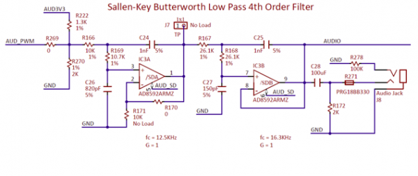
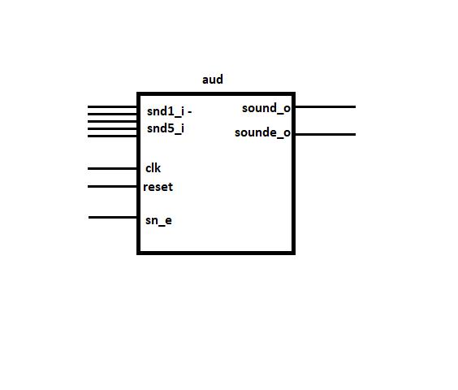
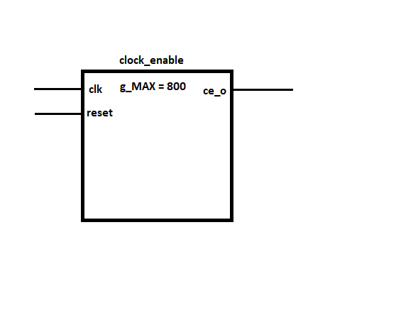
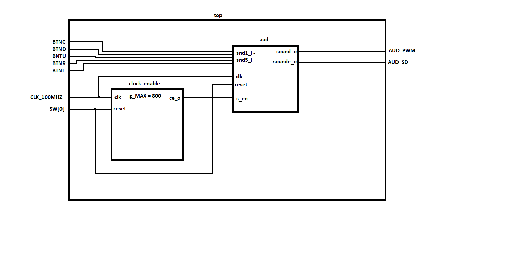

# Pwm modulace zvukového výstupu

### Team members

* Tomáš Svěcený - Kód projektu, testování s hardwarem, extra hardware, dokumentace, video prezentace
* Michal Vida - Dokumentace, testování
* Jan Ruibar - mimo první hodinu projektu zcela nepřítomen, pokusi o online kontakt neúspěšné, nepodílel se na projektu

Link to your GitHub project folder:

   [https://github.com/SaawySorenson/Digital-electronics-1/tree/main/labs/project](https://github.com/SaawySorenson/Digital-electronics-1/tree/main/labs/project)

### Table of contents
* [Project objectives](#objectives)
* [Hardware description](#hardware)
* [VHDL modules description and simulations](#modules)
* [TOP module description and simulations](#top)
* [Video](#video)
* [References](#references)

## Project objectives

Jako cíl projektu jsme se rozhodli pro napodobení "zvukové klávesnice" tzn. generování různých zvukových výstupů dle stisknuté klávesy.

Cíle: 
-zkušební verze kódu  
-kompilace kódu 
-otestování slyšitelné frekvence výstupu 
-konečná verze kódu 
-prezentace funkce 

## Hardware description

Mono audio output 
Audio Jack na desce Nexys A7 je připojen k filtru dolní propusti, který je ovládán portem AUD_PWM s pulzně šířkovou modulací a portem AUD_SD, 
který je třeba napájet logickou 1 (high) pro aktivaci funkce filtru.  
 
 
 
 
Buttons 
Tlačítka na desce jsou připojena k napájení 3.3V a jsou aktivní v 1 (high), na desce jsou definovány na portech BTNC, BTND, BTNU, BTNR, BTNL 
 
Switches 
Přepínač je použit pouze jeden pro funci reset, tedy port SW[0] logického vektoru 0-15, podobně jako tlačítka jsou přepínače aktivní v 1 (high), tedy 3.3V 
 

## VHDL modules description and simulations

aud 
 

clock_enable 
 

top 
 

## TOP module description and simulations

Write your text here.

## Video

Write your text here

## References

1. Write your text here.
